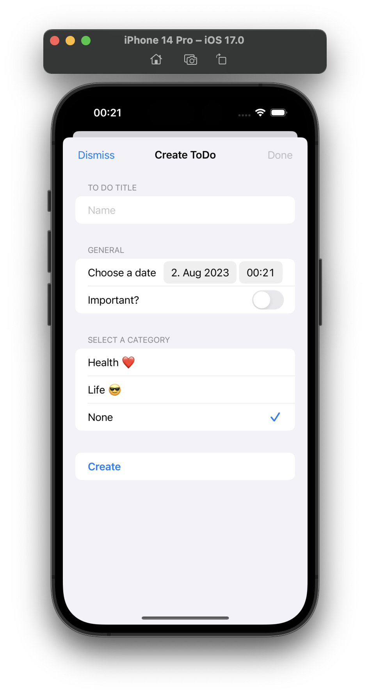

# Getting-Started
<!--</a>-->
Welcome to the To-Do List App! This guide will walk you through the features and functionalities of the app, helping you make the most out of it to organize and manage your tasks effectively.

### Table of Contents
1. [Installation](https://github.com/N3v1/To-Do-App/blob/main/How-To-Use.md#installation)
    - [Minimum Requirements](https://github.com/N3v1/To-Do-App/blob/main/How-To-Use.md#minimum-requirements)
2. [The main page](https://github.com/N3v1/To-Do-App/blob/main/How-To-Use.md#the-main-page)
    - [Adding a task](https://github.com/N3v1/To-Do-App/blob/main/How-To-Use.md#adding-a-task)

## Installation
To use the To-Do List App, follow these installation steps:

To install the app on your device, please follow these steps: First make sure you have Xcode 15 beta 4 installed on your Mac. Then clone this repository to your computer:

``` 
git clone https://github.com/N3v1/Apple-Calculator-Rebuild.git
```

Open the project in Xcode by selecting the ToDoListApp.xcodeproj file.
Choose your target device (simulator or connected device) and click "Run" (or press Cmd + R) to install and run the app.

### Minimum Requirements
- Xcode 15 beta 4
- iOS 17
  
</a>
<!--</a>-->
## The Main Page
The homepage is the application's core feature as it enables users to monitor and view all their tasks. It provides essential tools to increase productivity and boasts an aesthetically pleasing design.

### Adding a Task
To add a new task to your to-do list, follow these steps:

- Launch the To-Do List App on your device.
- Click the "New ToDo" button (+) located at the bottom-left corner of the main screen.
- Enter the name and any additional details for the task in the provided fields.
- Click "Create" to add the task to your to-do list.
