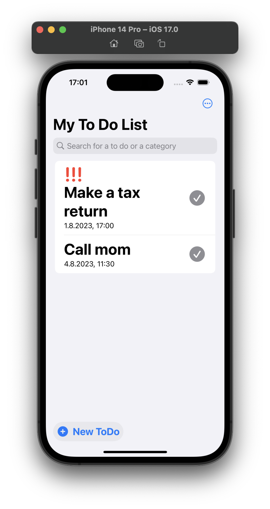

# To-Do-App
<!--</a>-->
This is a To-Do List App developed using SwiftUI. The app allows users to organize and manage their tasks by displaying them in a clear list. Users can add new tasks, edit or delete existing tasks, and track the progress of their tasks.

</a> 
## Minimum Requirements
- iOS 17
- macOS 13.4+
- Xcode 15 beta 4

## Features
**Add Tasks:** Add new tasks by using the "New ToDo" button and entering the name and additional details of the task.

**Edit Tasks:** You can edit existing tasks by swiping right on a reminder and clicking the pencil. Now you can make the desired changes.

**Delete Tasks:** If you have completed a task or no longer need it, you can click on or delete it by swiping right and clicking the garbage can.

**Manage Task Status:** Mark tasks as completed to track their progress and keep an overview of your activities by clicking on the gray tick of the reminder.

**User-friendly Interface:** The app provides an intuitive user interface that allows you to easily organize and manage your tasks.

## Installation
To install the app on your device, please follow these steps:
- Make sure you have Xcode 15 beta 4 installed on your Mac.
- Clone this repository to your computer:

## Technical Details
### Technologies
This app was developed using the following technologies:

- **SwiftUI:** A declarative user interface framework that allows you to create user-friendly and reactive apps.

   Link to the SwiftUI documentation [**here**](https://developer.apple.com/xcode/swiftui/).

- **SwiftData:** A powerful database management framework that ensures your tasks are stored reliably and efficiently. 

   Link to the Swift Data documentation [**here**](https://developer.apple.com/documentation/swiftdata/).

### How to use this app

### Contributing
If you would like to contribute to this project, I welcome pull requests. Please ensure that your changes are well-documented and maintain clean, readable code.

### License
This project is licensed under the MIT License - see the [`LICENSE`](LICENSE) file for more information.

### Known issues
None
