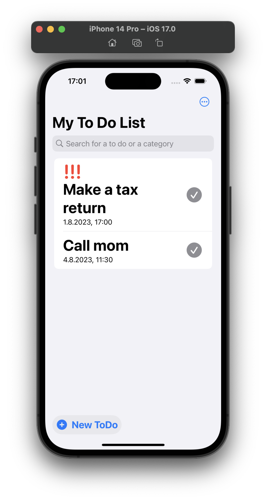

# To-Do-App
<!--</a>-->
To jest aplikacja z listą To-Do opracowana przy użyciu SwiftUI. Aplikacja pozwala użytkownikom organizować i zarządzać zadaniami, wyświetlając je na przejrzystej liście. Użytkownicy mogą dodawać nowe zadania, edytować lub usuwać istniejące oraz śledzić postępy w ich realizacji.

### Table of Contents

1. [Minimalne wymagania](https://github.com/N3v1/To-Do-App#minimum-requirements)
2. [Funkcje](https://github.com/N3v1/To-Do-App#features)
3. [Instalacja](https://github.com/N3v1/To-Do-App#installation)
4. [Detale techniczne](https://github.com/N3v1/To-Do-App#technical-details)
   - [Technologie](https://github.com/N3v1/To-Do-App#technologies)
   - [Jak używać tej Aplikacji](https://github.com/N3v1/To-Do-App#how-to-use-this-app)
   - [Contributing](https://github.com/N3v1/To-Do-App#contributing)
   - [Licencja](https://github.com/N3v1/To-Do-App#license)
   - [Znane problemy](https://github.com/N3v1/To-Do-App#known-issues)

</a> 

## Minimalne wymagania

- iOS 17
- macOS 13.4+
- Xcode 15 beta 4

## Funkcje

**Dodawanie zadań:** Dodawaj nowe zadania, korzystając z przycisku "New ToDo" i wprowadzając nazwę oraz dodatkowe szczegóły zadania.

**Edytowanie zadan:** Możesz edytować istniejące zadania, przesuwając palcem w prawo na przypomnieniu i klikając ołówek. Teraz możesz wprowadzić żądane zmiany.

**Usuwanie zadań:** Jeśli zadanie zostało ukończone lub nie jest już potrzebne, można je kliknąć i usunąć, przesuwając palcem w prawo i klikając kosz na śmieci.

**Zarządzanie statusem zadania:** Oznacz zadania jako ukończone, aby śledzić ich postępy i przeglądać swoje działania, klikając szary haczyk przypomnienia.

**Interfejs przyjazny dla użytkownika:** Aplikacja zapewnia intuicyjny interfejs użytkownika, który pozwala łatwo organizować i zarządzać zadaniami.

## Instalacja

Aby zainstalować aplikację na swoim urządzeniu, wykonaj następujące kroki:
Najpierw upewnij się, że masz zainstalowany Xcode 15 beta 4 na komputerze Mac.
Następnie sklonuj to repozytorium na swój komputer:

```bash
git clone https://github.com/N3v1/Apple-Calculator-Rebuild.git
```

## Detale techniczne

### Technologie

Ta aplikacja została opracowana przy użyciu następujących technologii:

- **SwiftUI:** Deklaratywny framework interfejsu użytkownika, który pozwala tworzyć przyjazne dla użytkownika i reaktywne aplikacje.

   [**Link do documentacji SwiftUI**](https://developer.apple.com/xcode/swiftui/).

- **SwiftData:** Skuteczny framework zarządzania bazą danych, która zapewnia niezawodne i wydajne przechowywanie zadań.

    [**Link to the Swift Data documentation**](https://developer.apple.com/documentation/swiftdata/).

### Jak używać tej Aplikacji

Aby uzyskać wprowadzenie do "Jak korzystać z aplikacji", kliknij [**tu**](How-To-Use.md).

### Contributing

Jeśli chcesz przyczynić się do tego projektu, zapraszam do składania pull requestów. Upewnij się, że zmiany są dobrze udokumentowane i utrzymują czysty, czytelny kod.

### Licencja

Ten projekt jest dostępny na licencji MIT - więcej informacji można znaleźć w pliku [`LICENSE`](LICENSE).

### Znane problemy

- [**🌟 Feature: Adding Darkmode support (#4)**](https://github.com/N3v1/To-Do-App/issues/4)
- [**📖 Documentation: Need help writing How-To-Use.md (#3)**](https://github.com/N3v1/To-Do-App/issues/3) 
- [**☑️ ToDo: Unable to create categories (#2)**](https://github.com/N3v1/To-Do-App/issues/2)
- [**🧑‍💼 Translation: Adding German, Italian, Korean, Japanese and Chinese simplified (#6)**](https://github.com/N3v1/To-Do-App/issues/6)
- [**🧑‍💼 Translation: Translate README.md (#7)**](https://github.com/N3v1/To-Do-App/issues/7)

## Tłumaczenie

Oryginalny poradnik po angielsku:
<!-- Languages start -->
- [**🇺🇸 Englisch**](../README.md)

<!-- Languages end -->
